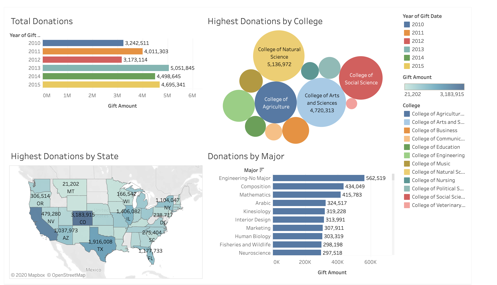
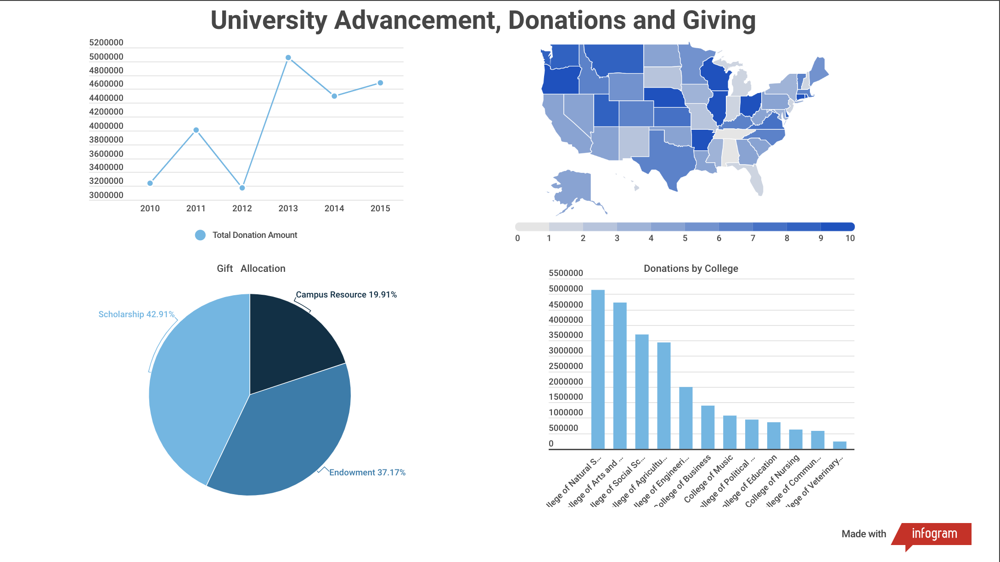
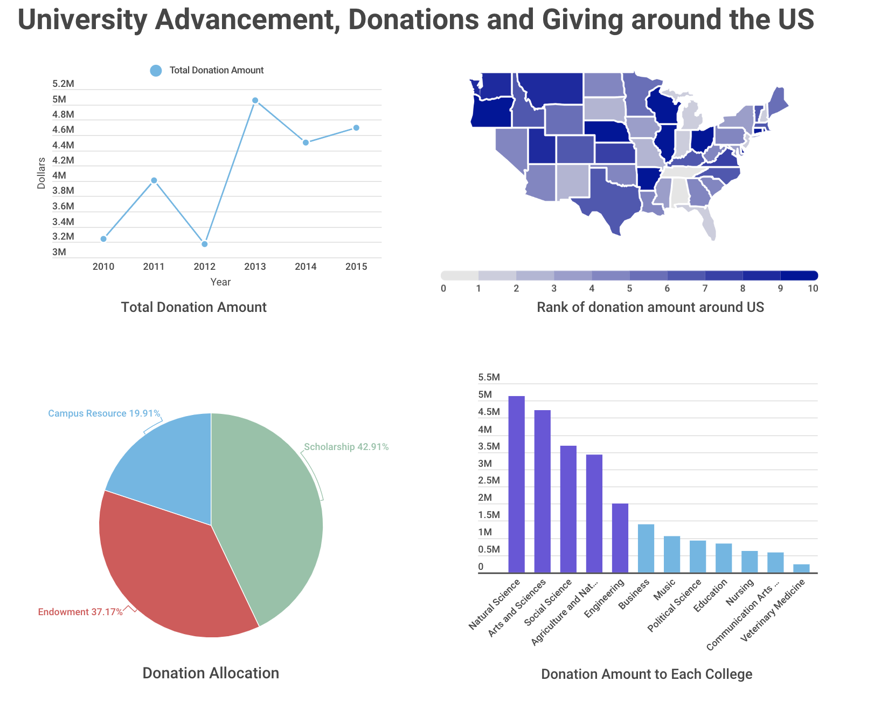

# Assignment 3 & 4: Critique by Design

> [Access the homepage click here](https://hyh1997112.github.io/Data-Visualization/)

## Step one: find a data visualization (with data you can use!)

- The embedded code does not work for this file, so I just paste the link here:
- [Critique Data Source - Tableau Public](https://public.tableau.com/views/UniversityAdvancementDonationsandGiving/Dashboard1?:display_count=y&:origin=viz_share_link)
- Author: himaja ravi
- Data source: [Tableau Public](https://public.tableau.com/en-gb/s/resources) University Advancement, Donations, and Giving
This is a table of donations made to Universities in the United States. The donation amounts and locations in this data set are not real as they are intended for training purposes only.
- 

## Step two: critique the data visualization
- Email address: yuhanh@andrew.cmu.edu
- Your name: Yuhan He

- What visualization are you ranking? Provide the title and web-accessible URL.
University Advancement, Donations and Giving
URL:
https://public.tableau.com/profile/himaja.ravi#!/vizhome/UniversityAdvancementDonationsandGiving/Dashboard1

- Describe your overall observations about the data visualization here. What stood out to you? What did you find worked really well? What didn't? What, if anything, would you do differently? *
- Describe your overall observations about the data visualization here.
- This data visualization contains four parts, with two bar charts, one bubble chart and one map.
Informative: The donation amounts and locations in this data set are not real as they are intended for training purposes only. However, if we consider the data as real data, it is still not very informative. Two charts in it contain similar information and is not complete. In the original dataset, there is more information to show.

- Emotive: The author uses many colors for the chart, it makes the dashboard complex. Also, there is no focus for each chart, thus it does not deliver very clear information to audiences.

- What stood out to you? 
- The colors the author chosen is various and there are different types of chart in the dashboard.
There are three different chart types.

- What did you find worked really well? What didn't?
- When expressing Donations by Major data, the author used descending order to show which major has made the most donations to the school.
It only shows some information about university donations. However, the message the author would like to deliver is quite vague. 
The first two pictures have too many colors, making it difficult for the audience to find the point that the author wants to express.
In addition, the size difference of each bubble in the bubble chart is not very large, and it is difficult for the audience to understand the author's intention to put this picture.

- What, if anything, would you do differently? 
- I'll replace the bar graph showing the total donation with a line chart so that I can see the change in total donations more clearly between years. At the same time, I will not use so many colors to distract the audience, but use gray appropriately to represent the less important data. Highest Donations by College and Donations by Major have similarities in the information they want to express to a certain extent. If they are modified, I will keep only one of the two pictures and replace the other with other data. For instance, use the gift allocation data to create the fourth chart.

- Who is the primary audience for this tool? Do you think this visualization is effective for reaching that audience? Why or why not?
- The audience is mainly school staff who manage donations and other information or state officials who manage donations to schools. For example, the staff of the government education department.
I do not think this visualization is effective for reaching that audience. Firstly, it does not extract enough information from the original dataset. In addition, it might be confusing for the audience to understand the key point of the dashboard. Furthermore, the chart type the author chooses is not very suitable for the data content.

- Final thoughts: how successful what this method at evaluating the data visualization you selected? Are there measures you feel are missing or not being captured here? What would you change? Provide 1-2 recommendations (color, type of visualization, layout, etc.)
- This method is quite successful at evaluating the data visualisation I selected. I would recommend to add the layout and color evaluation. Because in a dashboard, the consistency of color and harmony is quite significant. If the chart contains uncoordinated color, the audiences' focus might be distracted. For the layout, it is very significant to make the whole dashboard logically fluent. Thus, I would like to recommend to add these two evaluation standards.

## Step three: wireframe a solution

## Step four: Test the solution
Feedback 1:
- Can you tell me what you think this is? Can you describe to me what this is telling you?

The content of the expression is not very clear. The title should be more distinctive, indicating whether it is a donation from all schools in the United States or a school.
- Is there anything you find surprising or confusing?

Note the horizontal and vertical units. It is confusing of the units of the amount.
- Is there anything you would change or do differently?

I think piechart should use different colors, because it is not a progressive relationship
 
Feedback2:
- Is there anything you find surprising or confusing?

It is very neat, there are many types of graphics. The topographic map is quite confusing. I don't know what it wants to express.
- Who do you think is the intended audience for this?

The audience may be the school leader.
- Is there anything you would change or do differently?

I will add some legends and comments.
 

## Step five: Build your solution
1. A link to the original data visualization (or screenshot - make sure to correctly cite your sources, etc.).  Include a short paragraph on why you selected this particular data visualization.  For obvious reasons, the data visualization you select should come from a publicly accessible source.  

- The embedded code does not work for this file, so I just paste the link here:
- [Critique Data Source - Tableau Public](https://public.tableau.com/views/UniversityAdvancementDonationsandGiving/Dashboard1?:display_count=y&:origin=viz_share_link)
- Author: himaja ravi
- Data source: [Tableau Public](https://public.tableau.com/en-gb/s/resources) University Advancement, Donations, and Giving
This is a table of donations made to Universities in the United States. The donation amounts and locations in this data set are not real as they are intended for training purposes only.
- 

I found the source of this data from tableau and someone visualized it. I found this visualization case on tableau public. Although this visualization case uses a variety of icons and many colors, the information it wants to express is not clear. In addition, too many legends on the sides can easily confuse viewers. I don't think this is a good visualization paradigm.

2. A couple paragraphs describing what your process was.  You should include a few insights you gained from the critique method, and what it led you to think about when considering a redesign, if anything.  You should talk about how you moved next to the wireframes, and any insights you gleaned from your user feedback.  If it led you to change anything about your data visualization's design, mention what that was.  Finally, talk about what your redesigned data visualization shows, why you selected the data visualization you did, and what you attempted to show or do differently. 
- I think the main audience for this visualization is government officials in the US education department. By analyzing the donation data of American universities, it can be helpful for decisions such as the allocation of future donations.
- First, I critiqued the original visualization and identified its shortcomings. For example, the original visualization has some relatively repeated information, and there are redundant legends. At the same time, because all the data is marked on the chart, the chart looks a bit complicated. There are also many problems with chart selection. For example, a line chart is more suitable than a bar chart to express changes in total donations over time. Even when using a bar chart, it is best to use time as the axis.
- Secondly, I selected a part of the data and made a dashboard using four charts. I changed the first chart to a line chart so that I can better see the total donation over time. When it comes to maps, I use ratings to make the data geographically clearer. I also added information on donation classifications to help listeners understand where their donations go on campus so they can make better decisions.
- Then I asked the opinions of two people, learned the defects of my graph, and made some modifications.
- After listening to their suggestions, I modified my visualization. Each picture is captioned. Also, the color of the pie chart has been changed because the data is not a progressive relationship. The top five targeted colleges for donations were highlighted to convey key messages to the audience. Removed some extra tags, such as the zeros behind the money and the "College of" in front of the college fields.
3. Your final data visualization!

