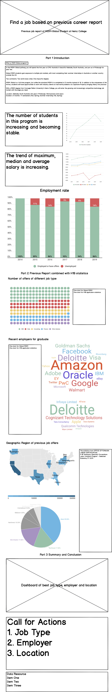

# Final project

> [Access the homepage click here](https://hyh1997112.github.io/94870portfolio/)

# Part II: Wireframes, storyboards, moodboards and user research
## Wirefames for user feedback
- 
## User research
### User research protocol
#### a target audience
* I have three main target audiences: The first category is the current MISM-Global students. Through the employment reports of graduated students in the past, they can adjust your own job hunting strategies accordingly. The second category is students who want to apply for the MISM-Global program. Knowing more specific employment information can help them decide whether to apply for the program. The third category is the instructors of the Employment Service Office. Through the analysis of past employment reports, the instructors can make better suggestions in the process of students finding jobs.
#### b representative individuals
#### c interview script
### Documented finding
#### d findings
#### e changes you implemented to your sketches, storyboards and wireframes to address the issues identified.
## Revised wireframes
- 
