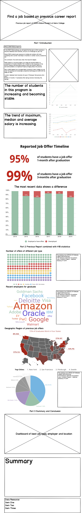

# Final project

> [Access the homepage click here](https://hyh1997112.github.io/94870portfolio/)

# Part II: Wireframes, storyboards, moodboards and user research
## Wirefames for user feedback
- 
## User research
### User research protocol
- a
- b
- c
- d
- e
### Documented finding
## Revised wireframes / visualizations / storyboards based on what you heard
## moodboards and personas
