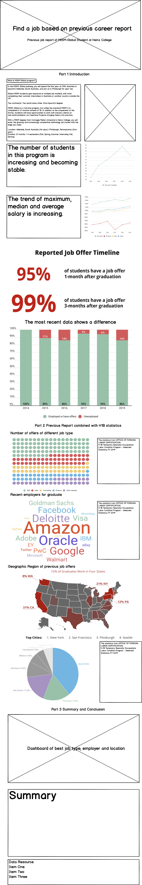
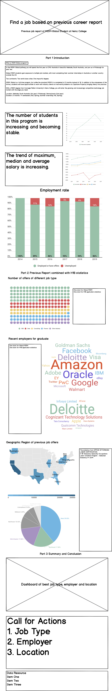

# Final project

> [Access the homepage click here](https://hyh1997112.github.io/Data-Visualization/)

# Final project overview
- [Final project website](https://carnegiemellon.shorthandstories.com/find-right-job-based-on-data/index.html)

## The idea

### Project outline (Part I)

### High-level summary (Part I)

**Find Right Job Based on Data**

In this project, I would like to visualize the career report of MISM global track at Heinz College to give some instructions to the current students in MISM program or students who want to apply for the program. The career reports on the Heinz website are in pdf format and it is very difficult to view the changes through years. Thus, I would like to visualize the MISM global track career data, including the employment rate, average salary, number of students who got offers from big companies. Showing these data could help current students or students who want to choose the program have a better career sight.

(In the MISM: Global pathway, you will spend the first year at CMU Australia in Adelaide, South Australia, and join us in Pittsburgh for year two. In the first summer vacation, the student will have an internship experience in countries around the world except US.)

### Project structure(Part I)
* Introduce the program of MISM global. 
* The average salary of students has remained at a relatively high level. And the average salary has been increasing. The maximum salary has also increased.
* The number of students in the project is increasing, and the employment situation has changed accordingly. Although the number of people in the project has increased, the employment rate has declined, and the employment rate will fall below 90% in 2019. Nevertheless, the employment rate for MISM global programs is relatively high in the US. 
* Thus, further analysis of the specific circumstances of admissions received by previous students is needed to increase the employment rate. For example, large companies like fb, google, etc. take students in this directory. As well as the positions that students have been accepted into. Also, include some data from the OFLC so to show the trend of foreign labor employment.
* By summarizing the above information, provide some suggestions and guidance for students of MISM global project and general mism project.

<iframe src="https://e.infogram.com/f5c92d3e-fb8f-4c34-9086-3687464026e4?src=embed" title="Untitled infographic" width="700" height="595" scrolling="no" frameborder="0" style="border:none;" allowfullscreen="allowfullscreen"></iframe>
<a href="https://infogram.com/f5c92d3e-fb8f-4c34-9086-3687464026e4" style="color:#989898!important;text-decoration:none!important;" target="_blank">Untitled infographic</a> <a href="https://infogram.com" style="color:#989898!important;text-decoration:none!important;" target="_blank" rel="nofollow">Infogram</a>

### Data sources (Part I)

* The main source of data is the official heinz website. On the website, you can see the employment statistics of MISM global students from 2014 to 2019 as of May.
* The information dilivery by the report is mainly on text. However, the data could be converted to numbers so that is is better for the audience to understand the report easily.
* The content of the report is mainly presented in text form. The main information is as follows.
1. The number of students in the project.
2. The number of graduated students.
3. The number of students who have an offer in the statistics.
4. The company, position and location of the student offer.
5. Statistics about wages.
6. Geographical distribution.
* The main data used in this project is derived from this.
* Data from Office of Foreign Labor Certification (OFLC) should be used to give some suggestions to the students.
* Also, the US average income data is included to provide a comparison.
* Some pictures from Unsplash are used in shorthands to make the page more pretty.

### Data resources (Part I)

Data source:
> [EMPLOYMENT INFORMATION & SALARY STATISTICS](https://www.heinz.cmu.edu/current-students/career-services/employment-information-salary-statistics)

> [OFLC Performance Data](https://www.foreignlaborcert.doleta.gov/pdf/PerformanceData/2019/H-1B_Selected_Statistics_FY2019_Q4.pdf)

> [Real Disposable Personal Income: Per Capita [A229RX0]](https://fred.stlouisfed.org/series/A229RX0)

Also find the pdf file in the github repository.
> [Heinz data link](https://github.com/hyh1997112/94870portfolio/blob/master/data/CareerReport.pdf)

> [OFLC data link](https://github.com/hyh1997112/94870portfolio/blob/master/data/H-1B_Selected_Statistics_FY2019_Q4.pdf)

Picture source:
- [Photo 1](https://unsplash.com/photos/kOuCX7fh50U) Photo by Free To Use Sounds on Unsplash
- [Photo 2](https://unsplash.com/photos/SYTO3xs06fU) Photo by Marvin Meyer on Unsplash
- [Photo 3](https://unsplash.com/photos/7Zb7kUyQg1E) Photo by Dan Freeman on Unsplash
- [Photo 4](https://unsplash.com/photos/J5R1KnBE4M4) Photo by Yuhan Du on Unsplash
- [Photo 5](https://unsplash.com/photos/8lnbXtxFGZw) Photo by Sharon McCutcheon on Unsplash
- [Photo 6](https://unsplash.com/photos/pKpipZVVEC0) Photo by Annie Spratt on Unsplash
- [Photo 7](https://unsplash.com/photos/hpjSkU2UYSU) Photo by Carlos Muza on Unsplash
- [Photo 8](https://unsplash.com/photos/5fNmWej4tAA) Photo by Helloquence on Unsplash

### Method and medium (Part I)

The final visualization, I want to use **shorthand** to render.

First, I will use platforms such as **tableau and infogram** to make raw data visualization diagrams.

Secondly, I will post visual charts on shorthand, plus text explanations. After reviewing the entire website, modify the visual chart data and type accordingly, and select the chart with a better presentation form.

Finally, add charts and text again, review the entire webpage, and listen to others. Make the final **shorthand** link after making changes.

## Design and user research

### Sketches and storyboards (Part II)

- 

### User research protocol and findings (Part II)

**target audience**

- I have three main target audiences: The first category is the current MISM-Global students. Through the employment reports of graduated students in the past, they can adjust your own job hunting strategies accordingly. The second category is students who want to apply for the MISM-Global program. Knowing more specific employment information can help them decide whether to apply for the program. The third category is the instructors of the Employment Service Office. Through the analysis of past employment reports, the instructors can make better suggestions in the process of students finding jobs.

**representative individuals**

- According to the scope of my audience, because the feedback from the employment service staff is difficult to obtain, I selected a student from the MISM global project, a student from the MEIM project, and an undergraduate who wanted to apply for the MISM global project as my interviewees.

**interview script**

- Introduction
- Hi, my name is Yuhan, this is the final project of my telling stories with data course, and I need feedback from my target audience. You have been selected as my interviewee. I hope you can objectively evaluate your thoughts on this project and answer some of my questions.
- Questions
1. Looking at this framework, what do you think the project wants to express? Please tell me which part of the project leads you to this idea.
2. Do you think the logic of the whole story is clear?
3. Do you have the feeling of engagement when looking at the project?
4. Do you think these chart visualizations clearly convey the point of view of the project?
5. Do you think the icons and words provide enough information to convey your point of view? What else do you think needs to be added or deleted?
6. How does the project feel to you overall? What part do you find confusing?
7. What will you do after viewing this story?
8. Do you have any other suggestions that can help me improve the entire project?

**Documented finding**

**findings**
- Positive feedback
1. The charts showing the main employers are beautiful. The graph showing the proportion of each job offer is beautiful.
2. The logic of the whole story is relatively clear, divided into three parts.
3. The information about employers, job types and geographic locations that are mainly to be transmitted can also be well transmitted to the audience.
- Negative feedback
1. The color tone of the entire project is messy, and a uniform color tone can make the webpage more beautiful.
2. The whole story wants to express too much information, you can appropriately delete some unnecessary charts, or merge some charts that can be used for comparison. It is only necessary to keep one employment ratio figure. For example, you can add some US average salary data to compare with existing data. 
3. The final summary can be written more clearly and write down what you want the audience to do.

**changes**
- Changes for the wireframe: Remove some redundant information, such as employment rate. Make new chart for the top 10 employers of which the employees apply most H1B. Change the main color to blue, remove the red chart part. Change the layout of the page. Add the call for action part at the end. 

### Wireframes (Part II)

- 

## Final data story

### Intended audience

### Work I've done so far

### Final project website

- [Final project website](https://carnegiemellon.shorthandstories.com/find-right-job-based-on-data/index.html)
